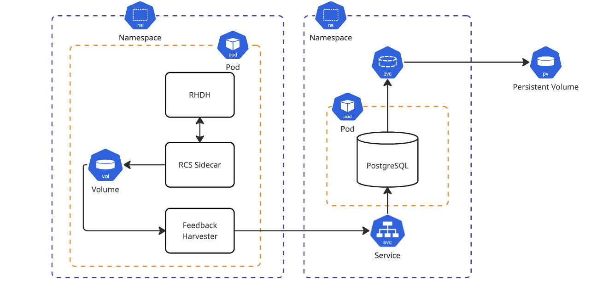

# Feedback Harvester

## Contributing

To contribute you will need to create your own virtual environment, you can do that by:

```
pdm venv create
```

OR

```
pdm venv create -p <pythonversion>
```

You can activate this virtual environment by:

```
`pdm venv activate`
```

To install dependencies in your virtual environment:

```
pdm install
```

## Required Environment Variables

This Python application is designed to connect to a PostgreSQL database. It depends on the following environment variables to connect to the database:

- `PGUSER`: Default value = 'postgres'
- `PGPASSWORD`: Default value = "password"
- `PGHOST`: Default value = "localhost"
- `PGDATABASE`: Default value = "postgres"
- `PGPORT`: Default value = "5432"

Additionally, this script will read from a set directory to obtain the data it intends on writing to the database. The following environment variables are required:

- `FEEDBACK_DIRECTORY`: Default value = "/tmp/data/feedback"
- `FETCH_FREQUENCY`: Default value = "15*60", or 15 minutes

## Building The Image

To build a new copy of the image you can run from the root of the repository:

```
make build-harvester
```

By default the image will be built for `linux/amd64` and tagged for you. If you wish to alter this functionality you can do the following:

Different tag (default is `latest`):
```
make build-harvester TAG=new-tag
```

Different image name (default is `quay.io/redhat-ai-dev/feedback-harvester`):
```
make build-harvester IMAGE_NAME=my-new-name
```

Different platform (default is `linux/amd64`):
```
make build-harvester PLATFORM=linux/arm64
```

You also combine all of these commands:
```
make build-harvester TAG=new-tag IMAGE_NAME=my-new-name PLATFORM=linux/arm64
```
## Diagram

